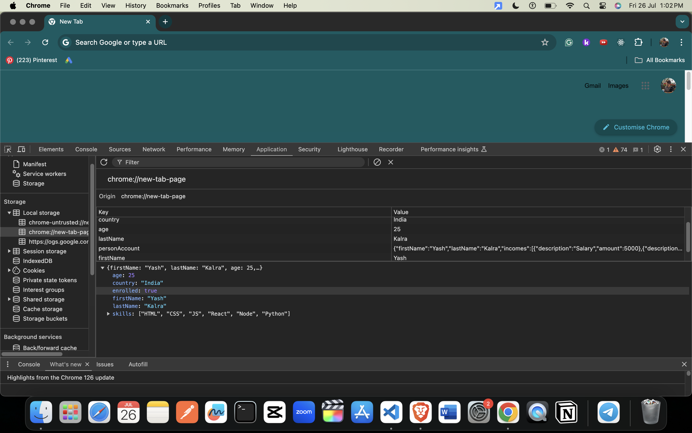

### HTML5 Web Storage: Concise Notes



**Web Storage Overview**
- **Web Storage** (sessionStorage and localStorage) is an HTML5 API for storing data on the client-side.
- Unlike cookies, data stored in Web Storage is not included in every server request, making it more secure and efficient.
- Web Storage allows storing larger amounts of data (at least 5MB) compared to cookies (around 4KB).

**Key Features**
- Data is accessible using JavaScript.
- Two main objects:
  - **sessionStorage**: Data is cleared when the page session ends.
  - **localStorage**: Data persists even after the browser is closed.

**Storage Characteristics**
- Data is specific to the protocol of the page.
- Keys and values are always stored as strings.

**sessionStorage**
- Available only within the current browser tab or window session.
- Designed to store data for a single session.

**localStorage**
- Data stored persists between browser sessions and is available across tabs and windows.
- Useful for storing data that needs to be retained long-term.

**Web Storage Methods**
- **setItem(key, value)**: Stores data.
- **getItem(key)**: Retrieves data.
- **removeItem(key)**: Removes specific data.
- **clear()**: Clears all stored data.
- **key(index)**: Retrieves the key name at the specified index.

**Use Cases**
- Temporary data storage.
- Saving shopping cart items.
- Data persistence across page requests and browser sessions.
- Offline data storage.
- Reducing server requests by storing static data.
- User authentication.

**Storing and Retrieving Data**
- Use `localStorage.setItem()` to store data as a string.
- If storing objects or arrays, stringify them using `JSON.stringify()`.
- Retrieve data using `localStorage.getItem()`.
- Parse stored strings back to objects/arrays using `JSON.parse()`.

**Examples**
```javascript
// Storing strings
localStorage.setItem('firstName', 'Asabeneh');
localStorage.setItem('age', '250');

// Storing arrays
const skills = ['HTML', 'CSS', 'JS', 'React'];
localStorage.setItem('skills', JSON.stringify(skills));

// Storing objects
const user = {
  firstName: 'Asabeneh',
  age: 250,
  skills: ['HTML', 'CSS', 'JS', 'React']
};
localStorage.setItem('user', JSON.stringify(user));

// Retrieving data
let firstName = localStorage.getItem('firstName');
let age = localStorage.getItem('age');
let skills = JSON.parse(localStorage.getItem('skills'));

console.log(firstName, age, skills);

// Clearing storage
localStorage.clear();
```

### Summary
- Web Storage is a powerful feature for client-side data storage, offering significant advantages over cookies.
- Choose **sessionStorage** for temporary data and **localStorage** for persistent data.
- Ensure to stringify complex data structures before storing and parse them after retrieval.

